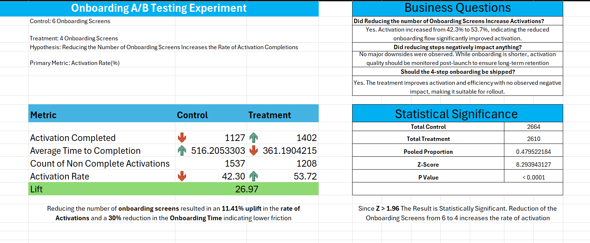
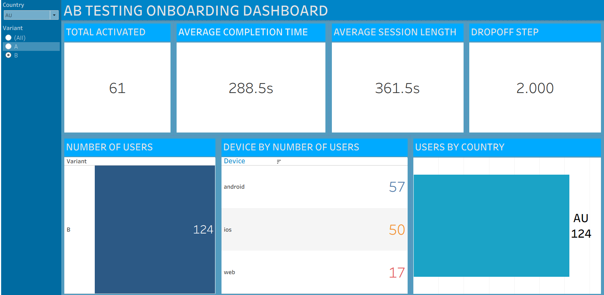

# Onboarding Screens A/B Testing Experiment

## Executive Summary

This project presents a comprehensive A/B testing experiment comparing the effectiveness of **6-step onboarding** (Control) versus **4-step onboarding** (Treatment) flows. The experiment demonstrates that **reducing onboarding complexity significantly improves user activation rates**.

### Key Finding
Reducing onboarding screens from 6 to 4 resulted in an **11.41% uplift in activation rate** with a **26.97% relative lift**, along with a **30% reduction in onboarding completion time**. This improvement is **statistically significant** (P < 0.0001).

---

## Experiment Overview

**Hypothesis:** Reducing the Number of Onboarding Screens Increases the Rate of Activation Completions

- **Control Group:** 6 Onboarding Screens
- **Treatment Group:** 4 Onboarding Screens  
- **Primary Metric:** Activation Rate (%)
- **Sample Size:** 5,274 total users (2,664 Control, 2,610 Treatment)

---
### Summary Sheet

### Business Impact Questions Answered

**Did reducing the number of onboarding screens increase activations?**
- **Yes.** Activation increased from 42.3% to 53.7%, indicating the reduced onboarding flow significantly improved activation.

**Did reducing steps negatively impact anything?**
- **No major downsides observed.** While onboarding is shorter, activation quality should be monitored post-launch to ensure long-term retention.

**Should the 4-step onboarding be shipped?**
- **Yes.** The treatment improves activation and efficiency with no observed negative impact, making it suitable for rollout.

---

## Experiment Results Dashboard

---

## Key Metrics Comparison

| Metric | Control (6 Steps) | Treatment (4 Steps) | Impact |
|--------|------------------|-------------------|--------|
| **Activation Completed** | 1,127 | 1,402 | ↑ +275 users |
| **Activation Rate** | 42.30% | 53.72% | ↑ +11.42% |
| **Avg Time to Completion** | 516.2 seconds | 361.2 seconds | ↓ -155 seconds (30%) |
| **Non-Complete Activations** | 1,537 | 1,208 | ↓ -329 users |
| **Lift** | - | - | **26.97%** |

---

## Statistical Significance

The experiment results are **highly statistically significant**, with a P-value < 0.0001:

- **Z-Score:** 8.29
- **Pooled Proportion:** 0.48
- **P-Value:** < 0.0001
- **Significance Threshold (Z > 1.96):** ✓ PASSED

This extremely low p-value (< 0.0001) provides overwhelming evidence that the 4-step onboarding is genuinely more effective than the 6-step version.

---

## Findings & Insights

## Data Overview

### Dataset Composition
- **Total Records:** 5,274 user sessions
- **Features:** User ID, Variant (A/B), Device (Android/iOS/Web), Country, Steps Completed, Activation Status, Session Length, Time to Completion, Dropoff Step
- **Geographic Distribution:** Users from US, UK, India, Canada, Australia, and Germany
- **Device Diversity:** Android, iOS, and Web platforms

---

## Recommendation: Adopt 4-Step Onboarding

1. **Improved Conversion:** The 4-step flow achieves a 53.72% activation rate vs. 42.30% for 6-step, a **+11.42 percentage point improvement**.

2. **Better User Experience:** Users complete the onboarding **155 seconds faster** (30% reduction), reducing friction and improving perceived product quality.

3. **Statistically Proven:** With a P-value < 0.0001 and Z-score of 8.29, this result is not due to chance—it's a genuine behavioral change.

4. **No Observable Trade-offs:** The experiment found no major negative impacts. Users are not dropping off at higher rates due to the streamlined flow.

---

## Technical Details

- **Tool Used:** Tableau (Dashboard.twb)
- **Data Source:** `data/Onboarding Screens Ab Testing.csv`
- **Analysis Method:** Two-proportion Z-test
- **Significance Level:** α = 0.05

---

## Conclusion

This A/B test provides clear, statistically significant evidence that **reducing onboarding complexity from 6 to 4 steps dramatically improves user activation** without apparent negative consequences. This finding is rare and valuable in product development, offering a clear path to improved metrics with quantified impact.
